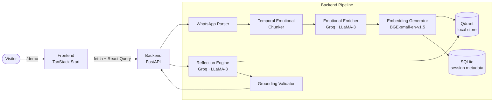
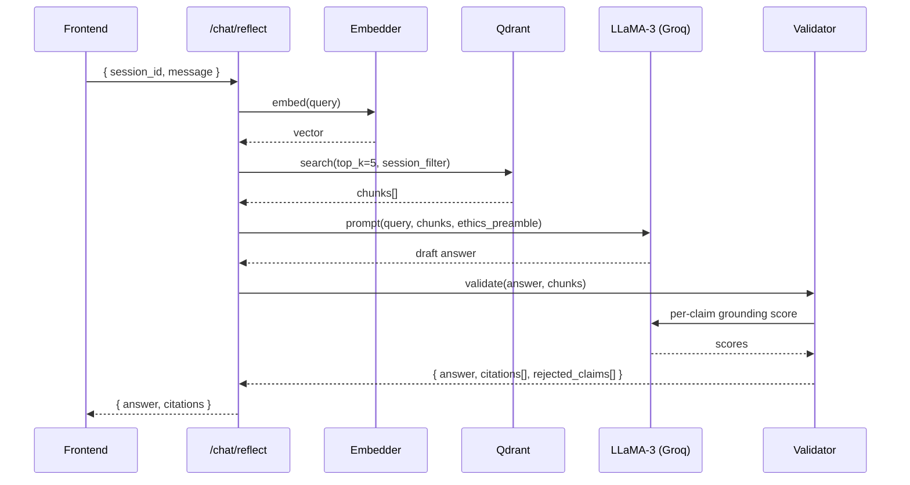

# Design Document — MVP Live Demo

## Overview

The MVP Live Demo wires the existing EchoVault AI marketing site (TanStack Start, React 19, Tailwind v4, shadcn/ui) to a real, working backend that runs the Temporal Emotional RAG pipeline. The goal is a small, polished, end-to-end experience that an investor or recruiter can run in under two minutes: open `/demo`, click "Try with sample data," see real chunks/embeddings/citations, then chat with their memories.

This is intentionally **not** the full production architecture. We make pragmatic choices that prioritize:

1. **Time-to-running-demo over scalability** — single-tenant, in-process services, no Kubernetes.
2. **Visible AI behavior over feature breadth** — the pipeline must be transparent on screen.
3. **Two repos, two deploys** — the existing frontend stays put; the backend lives in a new sibling repo `echovault-backend-demo`. They communicate over HTTPS with CORS.

### Repo layout

```
~/Demo for EchoVaultAI/
├── echo-vault-intelligence/        # existing — TanStack Start frontend
└── echovault-backend-demo/         # NEW — FastAPI backend (this design)
```

### Pragmatic deviations from the full architecture

| Production design | MVP demo choice | Reason |
| --- | --- | --- |
| Qdrant Cloud + PostgreSQL | **Qdrant Local (embedded, file-backed) by default; FAISS fallback** | Avoids managing a separate DB per session. Single Docker container or `pip install` works. |
| Per-user auth, RLS, KMS | **Anonymous demo sessions, in-memory session map** | No auth surface to demo. Deletion is a TTL sweep, not a complex audit log. |
| HuggingFace inference endpoint for BGE | **Local `sentence-transformers` model (BGE-small-en-v1.5)** | Eliminates a network hop per chunk; first cold start downloads ~130 MB. |
| Async event bus, queue workers | **Synchronous FastAPI handlers with `asyncio.gather` for fan-out** | Pipeline finishes in 5-15 s for the demo dataset; no need for background workers. |
| Postgres for metadata | **SQLite (file-backed) or in-memory dict** | Demo only needs simple lookups. SQLite is zero-config. |

These tradeoffs are documented inline in the backend code so the production path is clear.

---

## Architecture

### High-level flow



### Frontend ↔ Backend boundary

- **Transport:** HTTPS, JSON request/response. No WebSockets or SSE for v1 (we poll for upload status because the synchronous pipeline finishes quickly enough).
- **Session token:** the backend issues a `session_id` (UUID v4) on `POST /api/v1/demo/initialize`. The frontend stores this in `sessionStorage` and sends it as the `X-Session-Id` header on every subsequent request.
- **CORS:** backend allow-lists the frontend origin via a `FRONTEND_ORIGIN` env var (e.g., `http://localhost:8080` in dev, `https://echovaultai.app` in prod).

### Local development orchestration

`echovault-backend-demo/Makefile` provides:

```
make dev         # uvicorn app.main:app --reload --port 8000
make seed        # idempotently builds the synthetic demo dataset on disk
make docker      # docker compose up — backend + qdrant
```

The frontend reads `VITE_BACKEND_URL` (defaults to `http://localhost:8000`). A root-level `README.md` in each repo shows the two-terminal startup.

---

## Components and Interfaces

### Backend project structure (`echovault-backend-demo/`)

We use a lightweight DDD-flavored layout. We resist over-engineering — there are no aggregates or repositories with abstract interfaces here. Concrete classes are fine for an MVP.

```
echovault-backend-demo/
├── app/
│   ├── main.py                     # FastAPI app, CORS, router registration
│   ├── config.py                   # Pydantic Settings — env var loading
│   ├── api/
│   │   └── v1/
│   │       ├── __init__.py
│   │       ├── health.py           # GET  /api/v1/health
│   │       ├── memories.py         # POST /api/v1/memories/upload
│   │       │                       # POST /api/v1/memories/search
│   │       ├── chat.py             # POST /api/v1/chat/reflect
│   │       └── demo.py             # POST /api/v1/demo/initialize
│   ├── domain/
│   │   ├── models.py               # Pydantic — Message, MemoryChunk, Citation, …
│   │   └── enums.py                # EmotionalTone, ThematicTag
│   ├── services/
│   │   ├── parser.py               # WhatsApp parser
│   │   ├── chunker.py              # Temporal Emotional Chunker
│   │   ├── enricher.py             # Emotional Enricher (Groq)
│   │   ├── embedder.py             # BGE-small-en-v1.5 wrapper
│   │   ├── reflector.py            # Reflection Engine (Groq)
│   │   ├── validator.py            # Grounding Validator
│   │   └── pipeline.py             # Orchestrates upload → store
│   ├── infrastructure/
│   │   ├── vector_store.py         # Qdrant local client wrapper
│   │   ├── metadata_store.py       # SQLite via SQLModel
│   │   ├── groq_client.py          # Thin wrapper around Groq SDK
│   │   └── session_manager.py      # In-memory session registry
│   ├── data/
│   │   └── seed/
│   │       ├── whatsapp_sample.txt
│   │       ├── journal_entries.json
│   │       └── voice_note.json
│   └── errors.py                   # ApiError, error_handler middleware
├── tests/
│   ├── unit/
│   │   ├── test_parser.py
│   │   ├── test_chunker.py
│   │   └── test_validator.py
│   └── integration/
│       └── test_full_pipeline.py
├── scripts/
│   └── seed_demo.py                # Builds & persists the demo session on disk
├── .env.example
├── pyproject.toml                  # uv / poetry — Python 3.11+
├── Dockerfile
├── docker-compose.yml              # backend + qdrant
└── Makefile
```

### REST API

All endpoints return the envelope:

```json
{ "status": "ok" | "error", "data": {...} | null, "error": null | { "code": "...", "message": "..." } }
```

| Method | Path | Purpose | Auth header |
| --- | --- | --- | --- |
| GET | `/api/v1/health` | Liveness + dependency check | none |
| POST | `/api/v1/demo/initialize` | Create a demo session, return `session_id` and pre-seeded stats | none |
| POST | `/api/v1/memories/upload` | Multipart upload, runs full pipeline | `X-Session-Id` |
| POST | `/api/v1/memories/search` | Hybrid retrieval | `X-Session-Id` |
| POST | `/api/v1/chat/reflect` | Reflection chat with grounded answer | `X-Session-Id` |

Detailed schemas in **Data Models** below.

### Backend service responsibilities

Each service is a regular Python class with a tiny, testable surface.

| Service | Input | Output | External calls |
| --- | --- | --- | --- |
| `WhatsAppParser` | raw `.txt` bytes | `list[Message]` | none |
| `TemporalChunker` | `list[Message]` | `list[MemoryChunk]` (no embeddings yet) | none |
| `EmotionalEnricher` | `MemoryChunk` | enriched chunk (tone, intensity, themes) | Groq `chat.completions` |
| `Embedder` | `str` | `list[float]` (length 384) | local model |
| `VectorStore` | enriched chunk + embedding | persisted point | Qdrant |
| `MetadataStore` | session, chunk metadata | row | SQLite |
| `Reflector` | query, session | answer text + raw context chunks | Groq |
| `GroundingValidator` | answer, context chunks | annotated answer + citations | Groq (sentence-level) |
| `SessionManager` | — | session lifecycle (create, get, sweep) | in-memory + SQLite |

### Temporal Emotional Chunker — algorithm

Pseudo-code (`app/services/chunker.py`):

```python
TIME_GAP_MINUTES = 30
MIN_CHUNK_SIZE = 3
MAX_CHUNK_SIZE = 50

def chunk(messages: list[Message]) -> list[MemoryChunk]:
    if not messages: return []
    chunks: list[MemoryChunk] = []
    current: list[Message] = [messages[0]]

    for prev, msg in pairwise(messages):
        gap = msg.timestamp - prev.timestamp
        boundary_reason = None

        if gap > timedelta(minutes=TIME_GAP_MINUTES):
            boundary_reason = "time_gap"
        elif len(current) >= MAX_CHUNK_SIZE:
            boundary_reason = "size_limit"
        elif emotional_shift_detected(prev, msg):
            # cheap heuristic: punctuation + lexical signals; LLM call only if needed
            boundary_reason = "emotional_shift"

        if boundary_reason and len(current) >= MIN_CHUNK_SIZE:
            chunks.append(_finalize(current, boundary_reason))
            current = [msg]
        else:
            current.append(msg)

    if current:
        chunks.append(_finalize(current, "end_of_stream"))

    return chunks
```

`emotional_shift_detected` uses a fast lexical pre-filter (mood lexicon + punctuation density) and only invokes the LLM if the pre-filter is ambiguous. This keeps a 1000-message export under ~5s of LLM time.

### Emotional Enricher — prompt shape

A single Groq `llama-3.1-8b-instant` call per chunk, using JSON mode with a constrained schema:

```
SYSTEM: You analyze a short conversation segment and return JSON with:
  primary_tone (one of: reflective, encouraging, anxious, grateful,
                 uncertain, joyful, grieving, determined),
  intensity   (float 0..1),
  themes      (1-3 of: career, relationships, growth, loss, creativity,
                 health, family, identity)
USER: <chunk text, ≤ 2000 chars>
```

For the demo dataset (~30 chunks) this is ~30 fast inferences. For a 5 MB user upload we batch: every ~10 chunks in `asyncio.gather` with a concurrency cap of 5.

### Reflection Engine — flow



The system prompt is fixed and includes the ethical guardrails verbatim:

```
You are an analytical companion. You observe patterns and reflect.
You do not impersonate any person. You do not give therapy or medical advice.
Every factual claim MUST cite a chunk_id from the provided context.
If you cannot ground a claim, mark it [INFERENCE].
```

### Grounding Validator

Deterministic + lightweight model assist:

1. Split the draft answer into sentences (`spacy` or simple regex).
2. For each sentence, ask the LLM: "Which of these chunk_ids (if any) supports this claim, and with what confidence (0–1)?"
3. If best confidence < 0.7 → mark sentence `[INFERENCE]` or drop it (per requirement 7.6).
4. Build the `Citation[]` list from sentences with confidence ≥ 0.7.

### Frontend integration

#### New route — file-based routing

```
src/routes/demo.tsx                # /demo route
src/services/api-client.ts         # NEW — typed fetch wrapper
src/services/api-types.ts          # NEW — shared response/request types
src/hooks/use-demo-session.ts      # NEW — session bootstrap + persistence
src/hooks/use-pipeline-status.ts   # NEW — derived UI state
src/components/demo/
  ├── DemoHero.tsx                 # Heading + 2 CTAs
  ├── UploadZone.tsx               # Dropzone for .txt
  ├── PipelineStages.tsx           # Animated stage visualizer
  ├── MemoryChunkCard.tsx          # Single chunk with tags + intensity
  ├── ChunkList.tsx                # Scrollable list of chunks
  ├── ReflectionChat.tsx           # Chat surface (reuses chat.tsx visuals)
  ├── CitationBadge.tsx            # Color-coded confidence pill
  ├── BeforeAfterCompare.tsx       # Raw msgs vs emotional chunks
  └── ErrorState.tsx               # Backend-down banner
```

The site nav (`site-shell.tsx`) gains a `Demo` link between `Reflect` and `Waitlist`.

#### API client — shape

`src/services/api-client.ts` is a thin, typed `fetch` wrapper. No axios. It:

- Reads `import.meta.env.VITE_BACKEND_URL` once.
- Attaches `X-Session-Id` automatically when present.
- Parses the `{ status, data, error }` envelope and throws a typed `ApiError` on non-ok.
- Exposes one function per endpoint: `initializeDemo`, `uploadMemories`, `searchMemories`, `reflect`.

```ts
export class ApiError extends Error {
  constructor(public code: string, message: string, public status: number) {
    super(message);
  }
}

async function call<TResp>(path: string, init?: RequestInit): Promise<TResp> {
  const sessionId = sessionStorage.getItem("evd:session_id");
  const res = await fetch(`${BASE_URL}${path}`, {
    ...init,
    headers: {
      "Content-Type": "application/json",
      ...(sessionId ? { "X-Session-Id": sessionId } : {}),
      ...init?.headers,
    },
  });
  const body = await res.json();
  if (body.status === "error") {
    throw new ApiError(body.error.code, body.error.message, res.status);
  }
  return body.data as TResp;
}
```

#### React Query usage

| Query / mutation | Stale time | Notes |
| --- | --- | --- |
| `useInitializeDemo` (mutation) | — | Persists `session_id` to `sessionStorage` on success |
| `useDemoSession` (query) | 5 min | Hydrates UI from session metadata |
| `useUploadMemories` (mutation) | — | `onSuccess` invalidates `['session']` |
| `useSearchMemories` (mutation) | — | Search is user-driven, no caching |
| `useReflect` (mutation) | — | Each user message is a fresh mutation |

We do **not** use streaming; LLaMA-3-8B on Groq returns full responses in <2s for these prompts, so a single mutation with a loading skeleton is sufficient and simpler.

#### State management

- Server state: React Query.
- Local UI state: component-level `useState` (active stage index, current chat draft, expanded chunk).
- Session ID: `sessionStorage` (intentionally not localStorage — clears on tab close, matching ephemeral demo semantics).
- Pipeline progress: derived from the upload mutation's return value (the backend returns stage timings synchronously); no need for a global store.

#### Reusing the design system

All new components stick to the existing primitives:

- **Surfaces:** `glass glow-border` utility from `styles.css`.
- **Gradients:** `bg-gradient-primary`, `bg-gradient-accent`.
- **Color signals:** confidence ≥ 0.9 uses `--emerald`, 0.7–0.9 uses `--accent` (cobalt), <0.7 uses `--muted-foreground`.
- **Motion:** Framer Motion `initial/animate` patterns matching `chat.tsx`.
- **Components:** shadcn `Card`, `Badge`, `Progress`, `Tabs` reused for the pipeline visualizer.

The visual language of `/demo` mirrors `/chat` so the demo feels like a natural extension of the marketing site, not a bolt-on.

---

## Data Models

### Backend — Pydantic models (`app/domain/models.py`)

```python
from datetime import datetime
from enum import Enum
from pydantic import BaseModel, Field
from uuid import UUID

class EmotionalTone(str, Enum):
    reflective = "reflective"
    encouraging = "encouraging"
    anxious = "anxious"
    grateful = "grateful"
    uncertain = "uncertain"
    joyful = "joyful"
    grieving = "grieving"
    determined = "determined"

class ThematicTag(str, Enum):
    career = "career"
    relationships = "relationships"
    growth = "growth"
    loss = "loss"
    creativity = "creativity"
    health = "health"
    family = "family"
    identity = "identity"

class Message(BaseModel):
    sender: str
    timestamp: datetime
    content: str

class BoundaryReason(str, Enum):
    time_gap = "time_gap"
    emotional_shift = "emotional_shift"
    size_limit = "size_limit"
    end_of_stream = "end_of_stream"

class MemoryChunk(BaseModel):
    chunk_id: UUID
    session_id: UUID
    source: str                       # "whatsapp:filename.txt" | "journal:..." | "voice:..."
    text: str
    messages: list[Message]
    start_time: datetime
    end_time: datetime
    boundary_reason: BoundaryReason
    primary_tone: EmotionalTone | None = None
    intensity: float = Field(ge=0, le=1, default=0)
    themes: list[ThematicTag] = []

class Citation(BaseModel):
    chunk_id: UUID
    source: str
    date: datetime
    confidence: float = Field(ge=0, le=1)
    excerpt: str                      # short snippet for UI display

class ReflectionAnswer(BaseModel):
    answer: str                       # may contain [INFERENCE] markers
    citations: list[Citation]
    rejected_claims: list[str] = []

class DemoSession(BaseModel):
    session_id: UUID
    created_at: datetime
    expires_at: datetime              # created_at + 1 hour
    chunk_count: int
    sources: list[str]
```

### Backend — API request/response shapes

```
POST /api/v1/demo/initialize
  req:  {}
  resp: { session_id, expires_at, chunk_count, sources[], suggested_questions[] }

POST /api/v1/memories/upload
  req:  multipart/form-data, field "file" (.txt, ≤ 5 MB)
  resp: {
    parsed:    { message_count, date_range: [iso, iso], participants[] },
    chunks:    [ MemoryChunk... ],          # already enriched + embedded
    pipeline:  { parse_ms, chunk_ms, enrich_ms, embed_ms, store_ms }
  }

POST /api/v1/memories/search
  req:  { query: string, limit?: int = 5,
          filters?: { tones?: EmotionalTone[], themes?: ThematicTag[],
                       date_from?: iso, date_to?: iso } }
  resp: { results: [ { chunk: MemoryChunk, score: float } ] }

POST /api/v1/chat/reflect
  req:  { message: string, history?: [ {role, content} ] }
  resp: ReflectionAnswer

GET  /api/v1/health
  resp: { status, dependencies: { qdrant: ok|down, groq: ok|down, embedder: ok|down } }
```

### Frontend — TypeScript types

`src/services/api-types.ts` mirrors the Pydantic models. To keep them aligned without runtime overhead:

- Source of truth = backend Pydantic models.
- We generate `api-types.ts` from FastAPI's OpenAPI schema using `openapi-typescript` (`bunx openapi-typescript http://localhost:8000/openapi.json -o src/services/api-types.ts`).
- A `Makefile` target `make sync-types` and a one-line note in the frontend README. We do not auto-run it on every build — the demo surface is small and intentional drift is unlikely.

### Vector store payload (Qdrant)

```python
{
  "session_id": "<uuid>",
  "source": "whatsapp:demo.txt",
  "text": "<chunk text>",
  "start_time": "<iso>",
  "end_time": "<iso>",
  "primary_tone": "reflective",
  "intensity": 0.62,
  "themes": ["growth", "career"]
}
```

Vectors live in a single Qdrant collection `memories` with HNSW defaults. Filtering by `session_id` happens on every query; Qdrant indexes the field for performant filter-pushdown.

### Synthetic seed data

`app/data/seed/` contains:

| File | Format | Volume | Themes covered |
| --- | --- | --- | --- |
| `whatsapp_sample.txt` | WhatsApp export | ~30 messages, 6 months | encouragement, reflection, uncertainty |
| `journal_entries.json` | `[{date, text}]` | 3 entries | growth, identity |
| `voice_note.json` | `{date, text}` (transcript) | 1 entry, ~120 words | reflection |

Content uses fictional first names (Asha, Riya, Marco) and avoids any real-person referents, satisfying requirement 8.5. The seed is committed to the repo and rebuilt by `make seed` on container start so the demo session is always available without an LLM call to enrich it (we ship the enriched results too, gzipped).

---

## Correctness Properties

*A property is a characteristic or behavior that should hold true across all valid executions of a system — essentially, a formal statement about what the system should do. Properties serve as the bridge between human-readable specifications and machine-verifiable correctness guarantees.*

### Acceptance Criteria Testing Prework

(See the `prework` tool output below for the full per-criterion analysis.)

### Property 1: WhatsApp parser round-trip preserves messages

*For any* well-formed WhatsApp export string, parsing it into `Message[]` and reformatting back into the canonical WhatsApp line format should produce a string with the same number of lines, the same sender for each line, the same timestamp for each line, and the same content for each line.

**Validates: Requirements 2.2**

### Property 2: Chunker preserves message membership

*For any* `Message[]` input to the `TemporalChunker`, the union of `messages` across all returned `MemoryChunk[]` is equal (preserving order) to the input list. No message is dropped, duplicated, or reordered.

**Validates: Requirements 3.1, 3.2**

### Property 3: Chunker respects size bounds

*For any* `Message[]` input where the input length is ≥ `MIN_CHUNK_SIZE`, every returned `MemoryChunk` contains between `MIN_CHUNK_SIZE` (3) and `MAX_CHUNK_SIZE` (50) messages, with the possible exception of the final chunk which may be smaller if it represents end-of-stream.

**Validates: Requirements 3.2**

### Property 4: Time-gap boundaries are correctly detected

*For any* two consecutive messages whose timestamp gap exceeds `TIME_GAP_MINUTES` (30), the chunker places a chunk boundary between them, and the resulting boundary's `boundary_reason` is `time_gap`.

**Validates: Requirements 3.1, 3.5**

### Property 5: Enricher produces valid emotional metadata

*For any* `MemoryChunk` passed through the `EmotionalEnricher` (with the LLM mocked to return well-formed JSON), the resulting chunk has `primary_tone` ∈ `EmotionalTone` enum, `intensity` ∈ [0, 1], and `themes` is a non-empty subset of `ThematicTag` enum.

**Validates: Requirements 4.1, 4.2, 4.3**

### Property 6: Embedding has fixed dimensionality

*For any* non-empty input string passed to the `Embedder`, the returned vector has exactly 384 floating-point components and a finite L2 norm.

**Validates: Requirements 5.1**

### Property 7: Search returns only chunks belonging to the session

*For any* `session_id` and any query string, every chunk returned by `POST /api/v1/memories/search` has a `session_id` field equal to the requesting session's id. No cross-session leakage.

**Validates: Requirements 6.2, 6.3, 8.6, 11.4**

### Property 8: Search results are ordered by relevance

*For any* query and any non-empty result set, the `score` values returned by `/api/v1/memories/search` are non-increasing across the result list (sorted by descending similarity).

**Validates: Requirements 6.4**

### Property 9: Citations reference real, retrieved chunks

*For any* successful `/api/v1/chat/reflect` response, every `Citation.chunk_id` in the response refers to a chunk that was actually included in the retrieval context for that request.

**Validates: Requirements 7.4, 7.5**

### Property 10: Citations meet the confidence floor

*For any* successful `/api/v1/chat/reflect` response, every `Citation.confidence` is ≥ 0.7. Claims with grounding confidence below 0.7 either appear as `[INFERENCE]`-marked sentences in the answer or are dropped entirely; they do not appear as confident citations.

**Validates: Requirements 7.4, 7.6**

### Property 11: Session expiry deletes session data

*For any* session whose `expires_at` is in the past, after the cleanup sweep runs, no Qdrant points and no SQLite rows associated with that `session_id` remain.

**Validates: Requirements 11.4, 11.5**

---

## Error Handling

### Error envelope

Every backend response uses:

```json
{ "status": "error",
  "data": null,
  "error": { "code": "INVALID_FILE_FORMAT",
             "message": "Could not parse as a WhatsApp export." } }
```

### Error code catalog

| HTTP | code | When it fires | Frontend treatment |
| --- | --- | --- | --- |
| 400 | `MISSING_SESSION` | No `X-Session-Id` header | Re-initialize session, retry |
| 404 | `SESSION_NOT_FOUND` | Session expired or unknown id | Clear `sessionStorage`, prompt user to restart demo |
| 413 | `FILE_TOO_LARGE` | Upload > 5 MB | Inline error under upload zone |
| 422 | `INVALID_FILE_FORMAT` | Parser couldn't recognize WhatsApp format | Inline error with "expected format" hint |
| 429 | `RATE_LIMITED` | Per-IP throttle (10 reflections/min for the demo) | Toast: "give it a moment" |
| 502 | `UPSTREAM_LLM_ERROR` | Groq returned a non-2xx | Toast with retry button |
| 503 | `DEPENDENCY_DOWN` | Qdrant/Embedder unhealthy at startup | Demo page shows global error state |
| 500 | `INTERNAL_ERROR` | Unhandled exception (logged with traceback) | Generic error toast, do not leak stack |

A FastAPI `exception_handler` middleware converts uncaught exceptions and `ApiError` instances into the standard envelope. We never let raw stack traces reach the wire.

### Frontend error UX

- Backend unreachable on initial mount → `<ErrorState>` component takes over the demo route with a retry button (requirement 9.4).
- Per-mutation errors → inline below the offending control (upload zone, search bar, chat composer).
- React Query is configured with `retry: 1` for queries and `retry: 0` for mutations.
- Errors are never silent. Every `ApiError` either renders a visible message or fires a Sonner toast.

### LLM-specific failure modes

- **Malformed JSON from enricher:** wrap Groq calls in a tolerant parser; on failure, fall back to `primary_tone="reflective"`, `intensity=0.5`, `themes=["growth"]` and tag the chunk with `enrichment_degraded=True`. The frontend can show a subtle "fallback enrichment" badge if we want full transparency, but for v1 this is silent.
- **Validator overly strict:** if zero claims cross the 0.7 bar, the answer becomes "I don't see enough in your memories to answer that confidently." This is the right behavior, not an error.
- **Reflector refuses (impersonation guard):** model returns the canned ethical refusal directly; the backend forwards it unchanged with empty citations.

### Demo session lifecycle and cleanup

- Session created on `/demo/initialize` with `expires_at = now + 1h`.
- A background `asyncio` task in `app/main.py` runs every 5 minutes, walking expired sessions and deleting their Qdrant points and SQLite rows (requirement 11.5).
- On `SIGTERM` (e.g., container restart), all non-seed sessions are flushed before shutdown so we do not retain user uploads across deploys.

---

## Testing Strategy

### Layered approach

| Layer | Tooling | Scope |
| --- | --- | --- |
| Backend unit tests | `pytest` | `parser`, `chunker`, `validator` — pure functions, fully isolated |
| Backend property tests | `hypothesis` | Properties 1–6, 8 — see Correctness Properties section |
| Backend integration tests | `pytest` + FastAPI `TestClient` + mocked Groq | Properties 7, 9, 10, 11; full HTTP surface |
| Backend smoke test | `pytest -m smoke` | One real Groq call to confirm credentials work in CI |
| Frontend component tests | Vitest + React Testing Library | `UploadZone`, `ChunkList`, `CitationBadge` — interaction + rendering |
| Frontend E2E (manual) | open `/demo`, click through both flows | Pre-launch only, not CI |

We deliberately do **not** add E2E automation (Playwright) for this MVP — the user surface is small enough that manual smoke is faster than maintaining E2E infrastructure.

### Property-based test setup

- Library: `hypothesis` (Python). Min 100 iterations per property (`@settings(max_examples=100)`).
- Each property test is annotated with a comment in the format:
  `# Feature: mvp-live-demo, Property N: <property text>`
- Generators:
  - `messages_strategy` — produces well-formed `Message` lists with realistic timestamps.
  - `whatsapp_export_strategy` — formats `Message[]` back into the WhatsApp line format for round-trip tests.
  - `chunk_strategy` — pre-built `MemoryChunk` instances with valid metadata.
- Groq is mocked via a `FakeGroqClient` returning canned, schema-valid JSON. Real Groq is exercised only in the smoke test.
- Embedder is mocked with a deterministic 384-dim hash projection so embedding-related properties (Property 6) run fast.

### Unit test focus areas

- Parser: handles iOS vs Android WhatsApp variants, multi-line messages, system messages ("end-to-end encrypted"), forwarded messages.
- Chunker: empty input, single message, all-same-second messages, exact 30-minute gap edge case.
- Validator: extracts citations correctly when answer has no claims, all claims, mixed `[INFERENCE]` claims.
- Session manager: creation, retrieval, expiry sweep idempotency.

### Why PBT applies here

This feature is a strong fit for property-based testing:

- The parser and chunker are pure functions over rich, structured input — exactly where input variation reveals bugs.
- Round-trip properties on the parser catch a whole class of regressions cheaply.
- Invariants (no message dropped, score ordering, dim count) are easy to express and powerful.

We deliberately do **not** write property tests for:

- The Reflection Engine's *answer text quality* (no formal property exists; covered by manual review).
- Frontend rendering (snapshot testing is more appropriate; we skip it for MVP scope).
- Groq/Qdrant network behavior (out of our control).

### Frontend test focus

- `UploadZone` rejects non-`.txt` files and files > 5 MB with the right error.
- `CitationBadge` color-codes correctly: ≥0.9 emerald, 0.7–0.9 cobalt, <0.7 muted.
- `ReflectionChat` disables the send button while a mutation is pending.
- `useDemoSession` clears `sessionStorage` when it receives `SESSION_NOT_FOUND`.

### Configuration and environment

`.env.example` (backend):

```
GROQ_API_KEY=
GROQ_MODEL=llama-3.1-8b-instant
QDRANT_PATH=./.qdrant
EMBED_MODEL=BAAI/bge-small-en-v1.5
FRONTEND_ORIGIN=http://localhost:8080
SESSION_TTL_HOURS=1
MAX_UPLOAD_MB=5
```

Frontend `.env`:

```
VITE_BACKEND_URL=http://localhost:8000
```

Production deploy uses the same variables; only `FRONTEND_ORIGIN` and `VITE_BACKEND_URL` change. Secrets live in the platform's env management (Fly.io / Railway / Render — TBD), never in the repo.

### Deployment approach

- **Backend:** Docker Compose for local dev (FastAPI + Qdrant). For prod demo, single container on Fly.io or Render with Qdrant as an embedded local store mounted to a persistent volume — keeps cost near zero and the demo dataset re-seeds on startup.
- **Frontend:** existing Vercel deployment of `echo-vault-intelligence` continues unchanged. `VITE_BACKEND_URL` points to the deployed backend.
- **CI:** GitHub Actions on the backend repo runs `pytest` (unit + property + integration with mocks) on every PR. The smoke test against real Groq runs nightly on `main`.

This is enough infrastructure for an investor demo and nothing more. Anything beyond this — auth, multi-tenant scaling, observability stack — is explicitly out of scope and lives in the production design, not here.
