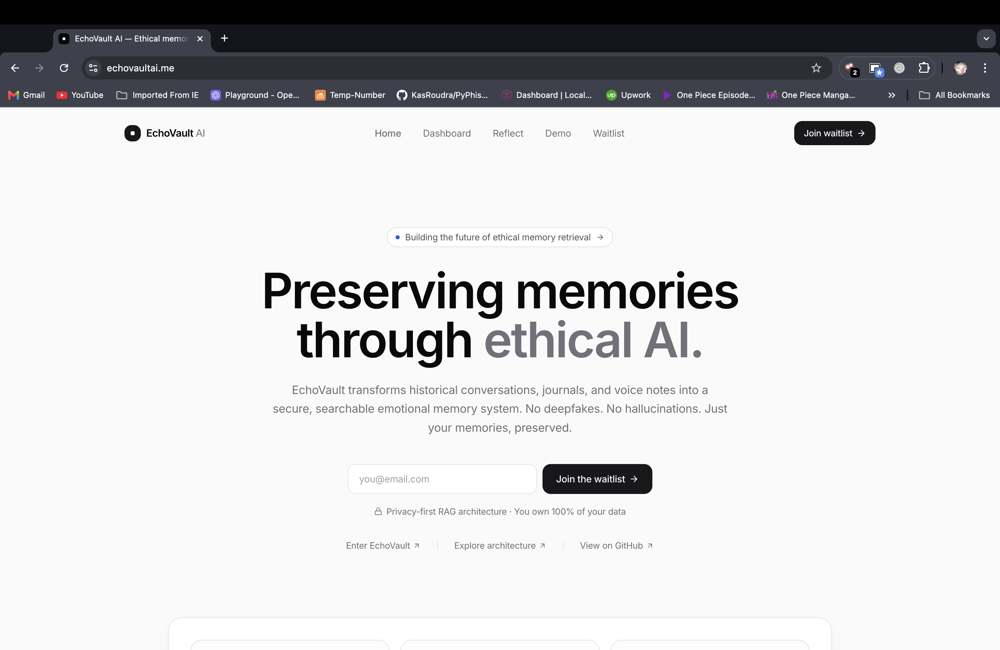
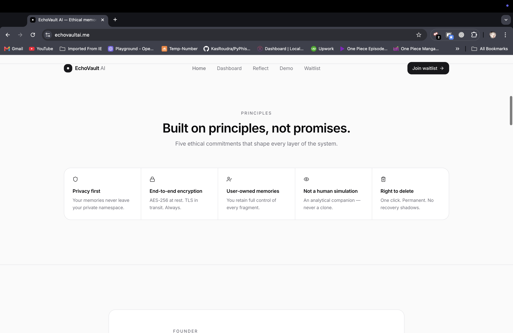
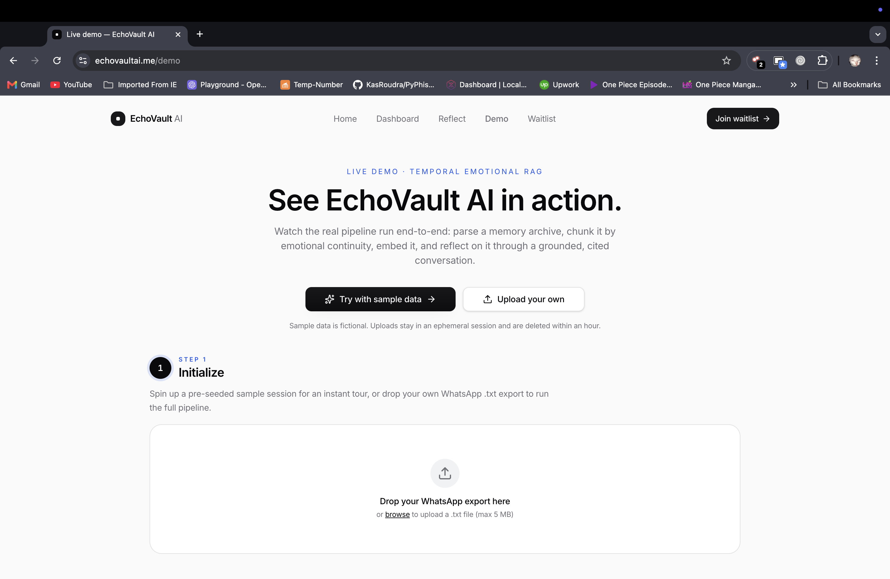
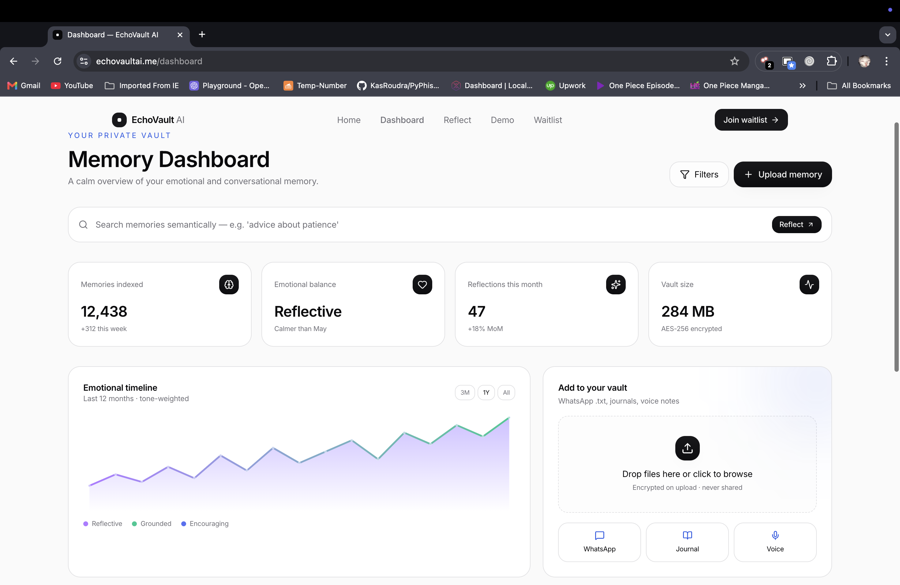
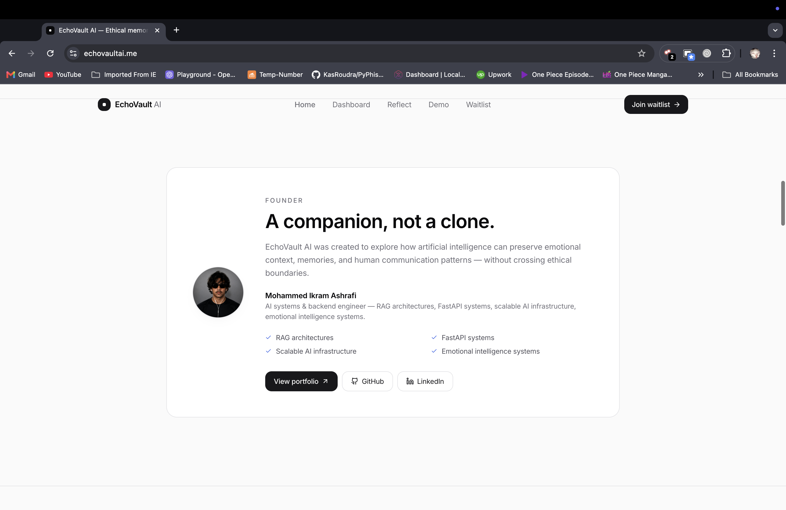

<div align="center">

# EchoVault AI · Frontend

**Marketing site + live demo for the Temporal Emotional RAG pipeline.**

[](https://echovaultai.me)
[](https://echovaultai.me/demo)
[](https://github.com/miashraf1818/echovault-backend-demo)

[](https://react.dev/)
[](https://tanstack.com/start)
[](https://tailwindcss.com/)
[]()
[](LICENSE)

</div>

---

## See it in action

<table>
  <tr>
    <td width="50%"></td>
    <td width="50%"></td>
  </tr>
  <tr>
    <td><sub><b>Marketing site.</b> Premium, calm, mobile-first.</sub></td>
    <td><sub><b>Five ethical commitments.</b> Privacy, encryption, ownership, no impersonation, right to delete.</sub></td>
  </tr>
  <tr>
    <td width="50%"></td>
    <td width="50%"></td>
  </tr>
  <tr>
    <td><sub><b>Live demo.</b> Three-step guided pipeline (Initialize → Explore → Reflect) running the real backend.</sub></td>
    <td><sub><b>Memory dashboard.</b> Semantic search, emotional timeline, AES-256 encrypted vault.</sub></td>
  </tr>
  <tr>
    <td colspan="2" align="center"></td>
  </tr>
  <tr>
    <td colspan="2" align="center"><sub><b>A companion, not a clone.</b> Built solo by Mohammed Ikram Ashrafi.</sub></td>
  </tr>
</table>

---

## What is this

The TanStack Start frontend for **EchoVault AI** — an emotional memory intelligence platform. Hosts the marketing site, the analytical companion chat preview, the live `/demo` route that runs the real backend pipeline end-to-end, and the waitlist.

The FastAPI backend lives in [echovault-backend-demo](https://github.com/miashraf1818/echovault-backend-demo). The two repos communicate over HTTPS with CORS and deploy independently (this on Vercel, the backend on Render).

> Drop a WhatsApp `.txt` export. Watch the pipeline parse → chunk by emotional continuity → enrich with Groq · LLaMA-3 → embed with BGE-small → store in Qdrant. Then ask the analytical companion any question — every answer cites a real memory chunk.

---

## Highlights

- **Real demo, not a video.** The `/demo` route hits a live FastAPI backend running the full Temporal Emotional RAG pipeline in production. ~2 seconds end-to-end on a 5MB upload.
- **3-step guided experience.** Initialize → Explore Memories → Reflect. Pipeline timings, chunk visualizations, and grounded citations all rendered live.
- **Animated pipeline visualizer.** 5-stage flow (Parse · Chunk · Enrich · Embed · Store) with per-stage ms timings, share-of-total bars, and a slow pulse on the active stage.
- **Before/after chunk explorer.** Raw WhatsApp messages on the left, emotional chunks with mood badges on the right, color-coded boundary annotations between them.
- **Citation badges.** Every reflection sentence links back to a chunk with source name, date, and confidence percentage.
- **Mobile-first.** Hamburger drawer nav, responsive demo layout, real waitlist form via Formspree.
- **Type-safe API client.** Generated from the backend's OpenAPI schema using `openapi-typescript`.

---

## Tech stack

| Layer | Tools |
|---|---|
| Framework | TanStack Start (React 19, Vite, file-based routing) |
| Styling | Tailwind v4 + shadcn/ui + Framer Motion |
| State | TanStack Query (React Query) |
| Forms | Formspree (waitlist) |
| Tests | Vitest + React Testing Library |
| Deploy | Vercel |
| Custom domain | echovaultai.me |

---

## Routes

| Path | Component | Notes |
|---|---|---|
| `/` | `index.tsx` | Marketing home — hero, principles, features, founder, waitlist |
| `/demo` | `demo.tsx` | The live pipeline demo (calls backend) |
| `/dashboard` | `dashboard.tsx` | Memory archive UI preview (read-only mock for MVP) |
| `/reflect` | `reflect.tsx` | Reflection chat preview (sample interaction, not live) |
| `/waitlist` | `waitlist.tsx` | Standalone waitlist signup |

---

## Local setup

This is the sibling repo to `echovault-backend-demo` (the FastAPI backend). Run both side by side for local development.

```
~/Demo for EchoVaultAI/
├── echo-vault-intelligence/    # frontend  (TanStack Start, :8080)   ← you are here
└── echovault-backend-demo/     # backend   (FastAPI,        :8000)
```

### Prerequisites

- Node 20+ (we use the LTS)
- The backend running locally on `:8000` (or a deployed backend URL)

### Install + run

```bash
# 1. Install dependencies
npm install

# 2. Copy the env template
cp .env.example .env.local
$EDITOR .env.local

# 3. Run the dev server
npm run dev
# → vite serves on http://localhost:8080
# → demo page at   http://localhost:8080/demo
```

### Configuration

| Variable | Default | Purpose |
|---|---|---|
| `VITE_BACKEND_URL` | `http://localhost:8000` | Origin of the FastAPI backend. Production points at the Render URL. |
| `VITE_FORMSPREE_ID` | `xaqkaayp` | Formspree form id used by the waitlist. Override per environment. |

---

## Scripts

| Command | What it does |
|---|---|
| `npm run dev` | Vite dev server on `:8080` with HMR |
| `npm run build` | Production build to `.output/` |
| `npm run preview` | Preview the production build locally |
| `npm test` | Run the Vitest test suite |
| `npm run lint` | ESLint |
| `tsc --noEmit` | Typecheck without emitting |

---

## Project layout

```
src/
├── routes/                  TanStack Start file-based routing
│   ├── index.tsx           /
│   ├── demo.tsx            /demo (the live pipeline demo)
│   ├── dashboard.tsx       /dashboard
│   ├── reflect.tsx         /reflect
│   └── waitlist.tsx        /waitlist
├── components/
│   ├── site-shell.tsx      Site nav + mobile drawer + footer
│   └── demo/               Demo-specific components (PipelineStages, ChunkList, ReflectionChat, …)
├── hooks/                   use-demo-session, use-pipeline-status, use-memory-mutations
├── services/
│   ├── api-client.ts       Typed fetch wrapper for the backend envelope
│   ├── api-types.ts        OpenAPI-generated types (regenerate via `npm run sync-types`)
│   └── waitlist.ts         Formspree submission with typed errors
├── lib/utils.ts             cn helper, design tokens
└── styles.css               Tailwind v4 + custom design tokens (glass, glow-border, gradients)
```

---

## Test coverage

The frontend keeps a small but high-signal test surface — interaction-level tests that exercise the bits most likely to break visually:

- `UploadZone` — rejects non-`.txt` files and files >5MB with the right error
- `CitationBadge` — color-codes by confidence (≥0.9 emerald, 0.7-0.9 cobalt, <0.7 muted)
- `ReflectionChat` — disables send while a mutation is pending
- `useDemoSession` — clears `sessionStorage` on `SESSION_NOT_FOUND`

10 tests pass. We intentionally don't snapshot-test rendering for an MVP.

---

## Deploy

Deployed via Vercel. Push to `main` triggers an auto-deploy. Custom domain `echovaultai.me` (with `www` redirect).

Required Vercel env vars:
- `VITE_BACKEND_URL=https://echovault-backend-demo.onrender.com`
- `VITE_FORMSPREE_ID=xaqkaayp`

---

## Roadmap

The MVP demo is live. The product roadmap is documented across both repos as Kiro specs in `.kiro/specs/`. Next major phases:

- Phase 1: Real auth (Clerk integration, per-user namespaces)
- Phase 2: Knowledge graph view + emotional timeline
- Phase 3: Streaming chat (SSE), conversation history persistence
- Phase 4: Multi-source ingestion (Telegram, iMessage, audio)

---

## License

[MIT](LICENSE) © 2026 Mohammed Ikram Ashrafi

Built solo. Open to feedback, PRs, and conversation. Find me on [LinkedIn](https://www.linkedin.com/in/mohammed-ikram-ashrafi/) or [the portfolio site](https://www.mohammed-ikram-ashrafi.in/).
